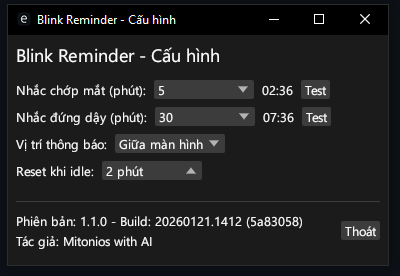

<div align="center">
  

  # 👁️ Blink Reminder

  **Nhắc nhở bạn chớp mắt và đứng dậy — bảo vệ sức khỏe mỗi ngày!**

  Ứng dụng miễn phí dành cho Windows, chạy nhẹ nhàng ở góc màn hình,<br>
  giúp bạn tránh mỏi mắt và đau lưng khi ngồi máy tính lâu.

  [](https://www.microsoft.com/windows/)
  [](https://github.com/Mitonios/EyeAndSkeleton/releases/latest)
  [](LICENSE)

</div>

---

## 🚀 Bắt đầu nhanh

Chỉ cần **3 bước** để sử dụng — không cần cài đặt phức tạp!

### 1️⃣ Tải về

👉 [**Tải Blink Reminder (.exe)**](https://github.com/Mitonios/EyeAndSkeleton/releases/latest)

Vào trang trên, tìm file **`blink-reminder.exe`** và nhấn tải về.

### 2️⃣ Chạy ứng dụng

Nhấp đúp vào file `blink-reminder.exe` để chạy.

> ⚠️ **Windows có thể hiện cảnh báo bảo mật** (vì ứng dụng chưa được ký số).
> Đây là bình thường! Nhấn **"More info"** (Thông tin thêm) → **"Run anyway"** (Vẫn chạy).

### 3️⃣ Xong rồi!

Ứng dụng sẽ chạy ẩn ở **khay hệ thống** (system tray) — khu vực biểu tượng nhỏ gần đồng hồ, góc phải dưới màn hình. Bạn sẽ thấy biểu tượng con heo nhỏ xuất hiện ở đó.

---

## ✨ Tính năng

| | Tính năng | Mô tả |
|:---:|:---|:---|
| 👁️ | **Nhắc chớp mắt** | Hiện animation nhắc bạn chớp mắt theo chu kỳ 1 / 5 / 10 / 30 phút |
| 🧍 | **Nhắc đứng dậy** | Hiện animation nhắc bạn đứng dậy vận động theo chu kỳ 30 / 45 / 60 phút |
| 📍 | **Vị trí tùy chọn** | Chọn vị trí hiển thị: góc trên-trái, trên-phải, giữa màn hình, dưới-trái, dưới-phải |
| 💾 | **Tự động lưu** | Thay đổi cài đặt được lưu ngay lập tức, không cần bấm nút "Lưu" |
| 💤 | **Phát hiện nghỉ** | Tự động tạm dừng khi bạn rời máy tính, reset lại khi bạn quay lại |
| 🪶 | **Siêu nhẹ** | Chỉ chiếm ~10MB ổ cứng và ~64MB RAM — không làm chậm máy |
| 🔒 | **Chạy một lần** | Chỉ cho phép 1 cửa sổ chạy, tránh trùng lặp |

---

## 📸 Giao diện

<div align="center">
  
  <br>
  <em>Cửa sổ cấu hình — nơi bạn tùy chỉnh mọi thứ</em>
</div>

<br>

Trong cửa sổ cấu hình, bạn có thể:

- **Chọn thời gian nhắc chớp mắt** — bao lâu thì nhắc một lần (mặc định: 5 phút)
- **Chọn thời gian nhắc đứng dậy** — bao lâu thì nhắc đứng dậy (mặc định: 45 phút)
- **Chọn vị trí thông báo** — thông báo hiện ở đâu trên màn hình (mặc định: giữa màn hình)
- **Cài đặt phát hiện nghỉ** — bao lâu không dùng máy thì tạm dừng nhắc nhở (mặc định: 2 phút)
- **Xem countdown** — thời gian đếm ngược đến lần nhắc tiếp theo
- **Nút Test** — thử ngay animation nhắc nhở

---

## 🔔 Cách hoạt động

### Biểu tượng ở khay hệ thống (System Tray)

Sau khi chạy, ứng dụng nằm ở **khay hệ thống** — dãy biểu tượng nhỏ ở góc phải dưới màn hình, cạnh đồng hồ.

- **Nhấp trái** vào biểu tượng → Mở cửa sổ cấu hình
- **Nhấp phải** vào biểu tượng → Hiện menu (Cấu hình / Thoát)

> 💡 **Mẹo:** Nếu không thấy biểu tượng, nhấn mũi tên **˄** ở khay hệ thống để hiện các biểu tượng ẩn.

### Animation nhắc nhở

Khi đến giờ nhắc nhở, một animation emoji sẽ hiện trên màn hình trong **5 giây** rồi tự biến mất:

| Loại nhắc nhở | Animation | Ý nghĩa |
|:---:|:---:|:---|
| Chớp mắt | 😌 ↔ 🙂 | Nhắm mắt — mở mắt, hãy chớp mắt nhé! |
| Đứng dậy | 🧍 ↔ 🧎 | Đứng lên — ngồi xuống, hãy vận động nhé! |

### Đóng cửa sổ ≠ Tắt ứng dụng

- Nhấn nút **X** (đóng cửa sổ) → Ứng dụng **vẫn chạy** ở khay hệ thống
- Muốn tắt hẳn → Nhấp phải vào biểu tượng ở khay → chọn **"Thoát"**

---

## ❓ Câu hỏi thường gặp

<details>
<summary><b>Windows hiện cảnh báo bảo mật khi chạy?</b></summary>
<br>
Đây là bình thường! Vì ứng dụng chưa được ký số (code signing), Windows SmartScreen sẽ hiện cảnh báo. Bạn chỉ cần:

1. Nhấn **"More info"** (Thông tin thêm)
2. Nhấn **"Run anyway"** (Vẫn chạy)

Ứng dụng hoàn toàn an toàn và mã nguồn mở — bạn có thể xem toàn bộ code trên trang GitHub này.
</details>

<details>
<summary><b>Làm sao để ứng dụng tự khởi động cùng Windows?</b></summary>
<br>

1. Nhấn **Win + R**, gõ `shell:startup` rồi nhấn Enter
2. Một thư mục sẽ mở ra — đây là thư mục "Khởi động cùng Windows"
3. Copy file `blink-reminder.exe` hoặc tạo shortcut của nó vào thư mục này
4. Từ giờ mỗi khi bật máy, ứng dụng sẽ tự động chạy!
</details>

<details>
<summary><b>Thông báo nhắc nhở không hiện lên?</b></summary>
<br>

- Kiểm tra xem ứng dụng có đang chạy ở khay hệ thống không
- Nếu đang dùng ứng dụng toàn màn hình (game, video), thông báo có thể bị che
- Thử nhấn nút **Test** trong cửa sổ cấu hình để kiểm tra
- Nếu vẫn không được, thử khởi động lại ứng dụng
</details>

<details>
<summary><b>Cài đặt của tôi không được lưu?</b></summary>
<br>

Cài đặt được lưu tự động vào thư mục `%APPDATA%/blink-reminder/`. Nếu không lưu được:

- Kiểm tra quyền ghi vào thư mục AppData
- Thử chạy ứng dụng với quyền Administrator
</details>

<details>
<summary><b>Ứng dụng có chiếm nhiều tài nguyên không?</b></summary>
<br>

Không! Blink Reminder rất nhẹ:
- **Ổ cứng:** ~10MB
- **RAM:** ~64MB
- **CPU:** Gần như 0% khi chạy nền

Ứng dụng được thiết kế để chạy nền cả ngày mà không ảnh hưởng đến hiệu suất máy tính.
</details>

<details>
<summary><b>Phát hiện nghỉ (Idle Detection) là gì?</b></summary>
<br>

Khi bạn rời khỏi máy tính (không di chuột, không gõ phím) quá thời gian cài đặt (mặc định: 2 phút), ứng dụng sẽ:

- **Tạm dừng** nhắc nhở (vì bạn đang nghỉ rồi!)
- Khi bạn quay lại dùng máy → **reset đếm ngược** từ đầu

Bạn có thể tắt tính năng này hoặc thay đổi ngưỡng thời gian trong cửa sổ cấu hình.
</details>

---

<details>
<summary><h2>🛠️ Dành cho nhà phát triển</h2></summary>

### Yêu cầu

- **Rust** toolchain stable (1.70+)
- **Windows** 10/11

### Build từ mã nguồn

```bash
git clone https://github.com/Mitonios/EyeAndSkeleton.git
cd EyeAndSkeleton
cargo build --release
```

File executable: `target/release/blink-reminder.exe`

### Chạy trong chế độ phát triển

```bash
cargo run --release
```

Bật logging để debug:

```bash
RUST_LOG=info cargo run --release
```

### Cấu trúc dự án

```
EyeAndSkeleton/
├── src/
│   ├── main.rs              # Entry point, khởi tạo threads và channels
│   ├── tray.rs              # System tray icon và menu (Win32 API)
│   ├── config.rs            # Cấu hình và persistence JSON
│   ├── config_window.rs     # Config window (egui/eframe)
│   ├── timer.rs             # Dual timer với tokio async + idle detection
│   ├── overlay.rs           # Transparent overlay (Direct2D/DirectWrite)
│   └── singleton.rs         # Singleton pattern và IPC
├── build.rs                 # Embed icon và manifest vào executable
├── app.manifest             # DPI awareness manifest
├── icon.ico                 # Application icon
├── Cargo.toml               # Dependencies và metadata
└── README.md
```

### Kiến trúc

```
┌─────────────────────────────────────────────────────────────┐
│                      Main Thread                            │
│  ┌─────────────────────────────────────────────────────┐    │
│  │              egui/eframe Config Window               │    │
│  │         (poll messages mỗi 100ms)                   │    │
│  └─────────────────────────────────────────────────────┘    │
│                          ▲                                  │
│                          │ std::sync::mpsc                  │
│  ┌───────────────────────┴───────────────────────────┐      │
│  │              Tray Event Handler Thread             │      │
│  └───────────────────────┬───────────────────────────┘      │
└──────────────────────────┼──────────────────────────────────┘
                           │ std::sync::mpsc
                           ▼
┌─────────────────────────────────────────────────────────────┐
│                    Background Threads                       │
│  ┌─────────────────┐  ┌─────────────────┐                  │
│  │   Tray Thread   │  │  Tokio Runtime  │                  │
│  │  (Win32 msg     │  │  ┌───────────┐  │                  │
│  │   loop)         │  │  │  Timer    │  │                  │
│  └─────────────────┘  │  │  Manager  │  │                  │
│                       │  └───────────┘  │                  │
│                       └─────────────────┘                  │
└─────────────────────────────────────────────────────────────┘
```

### Dependencies

| Mục đích | Crate | Mô tả |
|:---|:---|:---|
| GUI Framework | `eframe`, `egui` | Immediate mode GUI |
| Win32 APIs | `windows` | Tray, overlay, singleton, Direct2D |
| Async Runtime | `tokio` | Timers bất đồng bộ |
| Config | `serde`, `serde_json` | Serialize/deserialize JSON |
| App directories | `directories` | Đường dẫn %APPDATA% |
| Error handling | `anyhow` | Error handling |
| Logging | `log`, `env_logger` | Logging |
| Build | `winres` | Embed icon và manifest |

### Ký mã số & phát hành

```bash
# Build release
cargo build --release

# Ký file exe (cần certificate)
signtool sign /fd SHA256 /tr http://timestamp.digicert.com /td SHA256 /a target\release\blink-reminder.exe

# Kiểm tra chữ ký
signtool verify /pa target\release\blink-reminder.exe
```

### Đóng góp

Mọi đóng góp đều được chào đón! Vui lòng tạo [issue](https://github.com/Mitonios/EyeAndSkeleton/issues) hoặc pull request.

</details>

---

<div align="center">
  <p>
    <strong>Blink Reminder</strong> — Được tạo bởi <a href="https://github.com/Mitonios">Mitonios</a> with AI
    <br>
    Phân phối theo giấy phép <a href="LICENSE">MIT</a> · Phiên bản 1.1.0
  </p>
  <p>
    <sub>Đôi mắt của bạn xứng đáng được chăm sóc 👁️</sub>
  </p>
</div>
